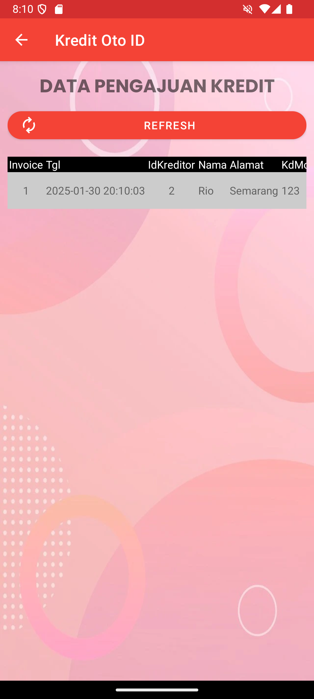

# Kredit Oto ID

Kredit Oto ID adalah aplikasi berbasis android yang dibangun menggunakan bahasa pemrograman Java untuk mengelola pengajuan kredit motor. Aplikasi ini memungkinkan pengguna untuk menginputkan data petugas, data motor, data kreditor, pengajuan kredit, dan data pengajuan kredit. Selain itu, aplikasi ini juga dilengkapi dengan fitur untuk mengedit dan menghapus data yang tersimpan.

## Teknologi yang Digunakan

* Android Studio
* Java
* MySQL
* PHP

## Fitur

* Mengelola data petugas
* Mengelola data motor
* Mengelola data kreditor
* Formulir pengajuan kredit
* Mengelola data pengajuan kredit
* Laporan pengajuan kredit berupa PDF

## Konfigurasi Server Aplikasi
1. Copy folder jskreditmotor ke direktori XAMPP/Laragon (contoh: www atau htdocs)
2. Buat database dengan nama `db_android_1` menggunakan MySQL
3. Impor file `db_android_1.sql` ke dalam database yang telah dibuat
4. Server sudah siap digunakan

## Cara Penggunaan

1. Buka aplikasi Kredit Oto ID.
2. Pilih menu yang diinginkan (Data Petugas, Data Motor, Data Kreditor, Formulir Pengajuan Kredit, Data Pembayaran Angsuran).
3. Lakukan penginputan data yang sesuai dengan menu yang dipilih.
4. Klik tombol "Simpan" untuk menyimpan data.
5. Klik tombol "Hapus" untuk menghapus data.
6. Klik tombol "Edit" untuk mengedit data.

## Screenshot
### Tampilan Menu Utama
* MainActivity.java (activity_main.xml)

### Tampilan Menu Transaksi
* TransactionActivity.java (activity_transaction.xml)

### Tampilan Menu Tentang
* AboutActivity.java (activity_about.xml)

### Tampilan Kelola Data Petugas
* DataPetugasActivity.java (activity_data_petugas.xml)

### Tampilan Kelola Data Motor
* DataMotorActivity.java (activity_data_motor.xml)

### Tampilan Kelola Data Kreditor
* DataKreditorActivity.java (activity_data_kreditor.xml)

### Tampilan Formulir Pengajuan Kredit
* PengajuanKreditActivity.java (activity_pengajuan_kredit.xml)

### Tampilan Kelola Data Pengajuan Kredit
* DataPengajuanKreditActivity.java (activity_data_pengajuan_kredit.xml)

### Output PDF Laporan Pengajuan Kredit

## Lisensi

Aplikasi ini dibuat oleh Thio Van Agusti sebagai bagian dari tugas kuliah dari Universitas STEKOM Semarang dan tidak boleh digunakan untuk keperluan komersial tanpa izin dari pembuatnya. Penggunaan aplikasi ini untuk keperluan komersial tanpa izin dapat dianggap sebagai pelanggaran hak cipta.
